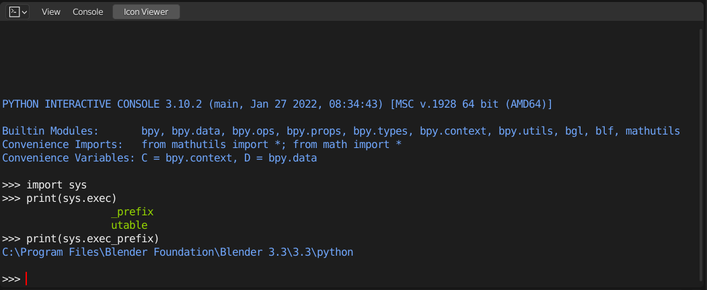
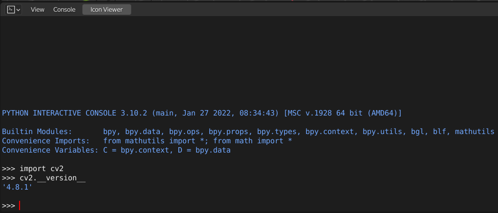

# 在Blender中使用pip安裝Python套件

本指南將介紹如何在Blender的專有Python環境中使用`pip`安裝第三方Python套件。Blender獨立的Python環境需要特殊的處理方式來安裝套件，本文將指導您完成必要的步驟。

## 安裝前準備

在開始之前，您需要在Blender的Python環境中安裝`pip`。以下步驟將指導您如何完成這一過程。

### 找到Blender專用Python Environment Path

1. 開啟Blender，並進入Scripting Workspace Window。
2. 在Blender的Python Console執行以下命令查看Blender使用的Python可執行文件路徑：
    ```python
    import sys
    print(sys.exec_prefix)
    ```
   
3. 記下顯示的路徑，並關閉Blender。

## 安裝套件

一旦安裝了`pip`，您就可以使用它來安裝所需的第三方Python套件。

1. 更新`pip`：
    ```bash
    "<Blender Python路徑>\bin\python.exe" -m pip install --upgrade pip
    ```
2. 使用`pip`來安裝套件`opencv-python`為例(下強制安裝的命令可以避免系統中主要python已安裝過目標套件導致的失敗)：
    ```bash
    "<Blender Python路徑>\bin\python.exe" -m pip install opencv-python --force-reinstall
    ```
## 驗證套件

安裝完成後，可以透過Blender Python Console來檢查套件是否成功被安裝。
1. 開啟Blender，並進入Scripting Workspace Window。
2. 在Blender的Python Console執行以下命令
    ```python
    import cv2
    cv2.__version__
    ```
    

## 重要說明

由於Blender具有獨立的Python環境，調用Blender的python使用`pip`安裝套件可以確保不會與系統安裝的Python環境發生衝突，從而保持Blender環境的穩定和一致性。

## 常見問題解決

大部分的錯誤與Python路徑有關，安裝成功後套件應該會出現於`<Blender Python路徑>\lib\site-packages`內，若總是安裝失敗請首先確認您是否使用了正確的Python路徑。
另外，您可以查看Blender控制台的錯誤信息，以獲取解決問題的線索。
